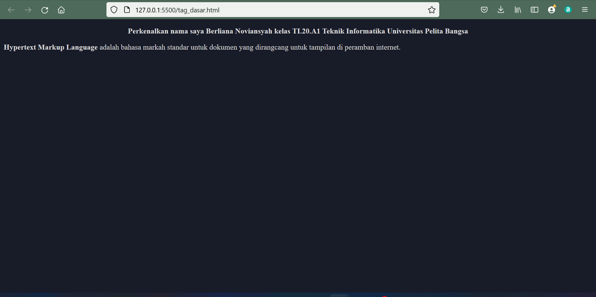
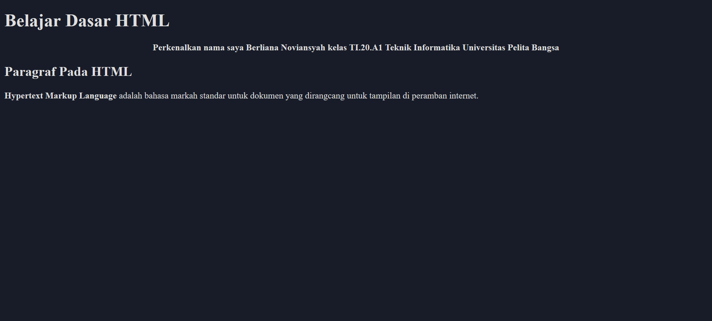
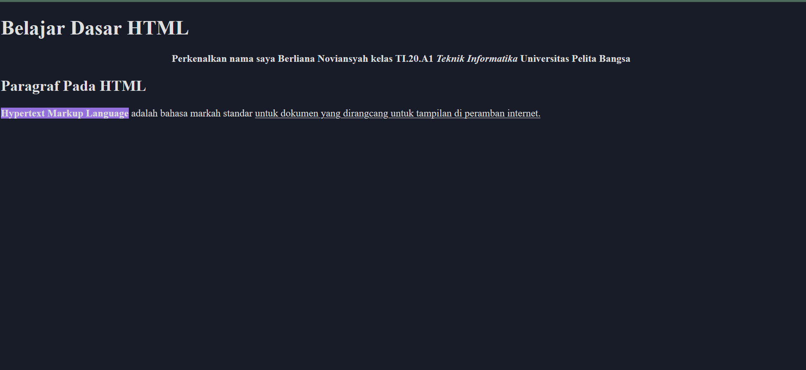
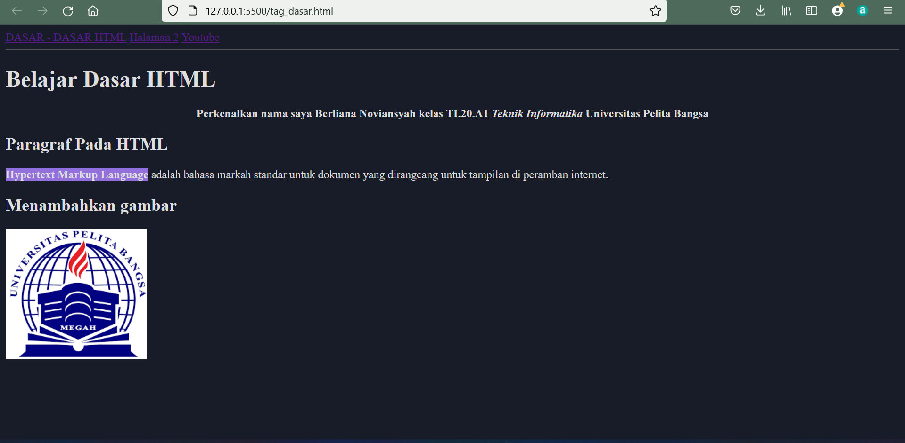

## Lab1Web

|   Berliana Noviansyah   |   312010373   |
|   -------------------   |   ---------   |
|   Teknik Informatika    |Pemrograman Web|


## 1. Membuat Paragraf Center & left
--------------------------------------------------


Gambar diatas adala contoh hasil dari tag <p> 
dengan contoh codingan sebagai berikut :

### Coding untuk membuat Center & Left paragraf
```html
<body>
    <!-- paragraf pertama -->
    <p align="center">
        <strong>Perkenalkan nama saya Berliana Noviansyah kelas TI.20.A1 Teknik Informatika Universitas Pelita Bangsa  </strong>
    </p>
   <!-- paragraf kedua -->
   <p align="left">
       <strong>Hypertext Markup Language </strong> adalah bahasa markah standar untuk dokumen yang dirangcang untuk tampilan di peramban internet.
   </p>
</body>
```


## 2. Membuat Judul Paragraf 1 & 2
--------------------------------------------------
Untuk membuat dan menambahkan Judul paragraf seperti dibawah ini :



Didapatkan dari codingan sebagai berikut :

```html
<body>
    <!-- Judul paragraf pertama -->
    <h1>
        <strong>Belajar Dasar HTML</strong>
    </h1>

    <!-- Judul Paragraf Kedua -->
    <h2>
        <strong>Paragraf Pada HTML</strong>
    </h2>
```
Dimana h1 digunakan untuk membuat header pertama dengan ukuran font yang besar, dan h2 digunakan untuk membuat header dengan ukuran yang lebih kecil daripada h1.


## 3. Mengaktifkan Bold
--------------------------------------------------
Bold sendiri adalah salah satu font style yang membuat huruf menjadi lebih tebal pada kata atau kalimat bahkan paragraf yang kita inginkan.

Dengan memuat codingan "strong" atau "b" :

```html
 <!-- paragraf pertama -->
    <p align="center">
        <strong>Perkenalkan nama saya Berliana Noviansyah kelas TI.20.A1 Teknik Informatika Universitas Pelita Bangsa  </strong>
    </p>
 ```

 Dengan hasil output sebagai berikut :
 


 ## 4. Mengaktifkan Underline
 --------------------------------------------------
 Underline atau garis bawah dapat digunakan untuk memberi garis yang berada dibawah teks tulisan yang mempunyai arti penting sehingga disarankan untuk menambahkan underline. Contoh outputnya sebagai berikut :

 

 pada kalimat "untuk dokumen yang dirangcang untuk tampilan di peramban internet."

 Coding untuk membuat underline adalah <u> : 

 <!-- paragraf kedua -->
   <p align="left">
       Hypertext Markup Language adalah bahasa markah standar <u>untuk dokumen yang dirangcang untuk tampilan di peramban internet.</u>
    </p>


## 5. Membuat Italic pada font
--------------------------------------------------
<i> digunakan untuk membuat perintah italic pada huruf atau kalimat yang memepunyai arti atau maksud penting.

Contoh coding untuk perintah italic :

```html
<!-- paragraf pertama -->
    <p align="center">
        Perkenalkan nama saya Berliana Noviansyah kelas TI.20.A1 <i>Teknik Informatika</i> Universitas Pelita Bangsa
    </p>
```
Dan dengan hasil output sebagai berikut :


Terdapat pada kalimat "Teknik Informatika"

## 6. Menambahkan gambar
--------------------------------------------------

Dengan menggunakan coding :

```html
 <!-- Menambahkan gambar -->
   <h2>Menambahkan gambar</h2>
   <!-- Menambahkan gambar pada dokumen -->
    
Dimana :
* "img src" digunakan sebagai baris perintah untuk memunculkan gambar yang diinginkan. <br>
* "alt" berfungsi untuk menginfokan pada saat gambar tidak muncul, jika gambar tidak muncul maka digantikan dengan tulisan yang terdapat pada alt tersebut.<br> 
* "title" digunakan untuk menamai gambar ketika kursor mengarah pada gambar yang dimasukkan. <br>
* "width" digunakan untuk mengatur besaran gambar yang dimasukkan.<br>

## 7. Membuat Link
--------------------------------------------------

Yang terakhir adalah menyisipkan link pada web. dengan menggunakan coding :

```html
 <!-- menambahkan navigasi -->
    <nav>
        <a href="tag_dasar.html">DASAR - DASAR HTML</a> 
        <a href="halaman2.html">Halaman 2</a>
        <a href="https://youtube.com/channel/UCyNhJVs_PRDm_7fnSjjNqWA">Youtube</a>
    </nav>
<hr>
```
Baris perintah yang digunakan untuk memunculkan link adalah "a href". <br>
"hr" digunakan untuk membuat garis horizontal.<br>
Berikut adalah contoh outputannya :<br>
